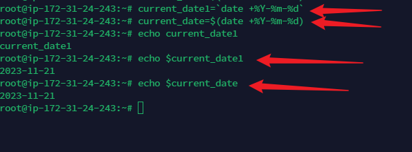
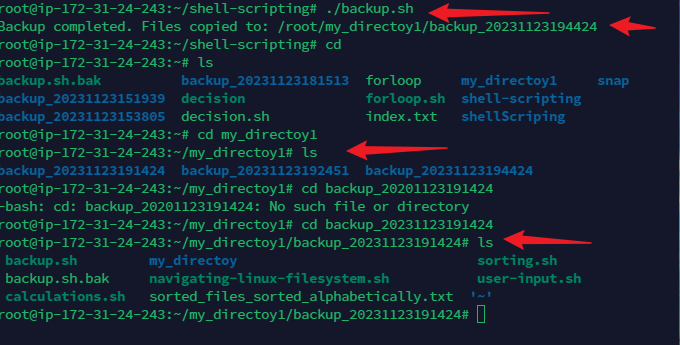

# ShellScripting

## Introduction
Shell Scripting is a text file with a list of command that instructs an operating system to perform certain tasks. 
It can also be defined as a way to automate task in Linux.  ShellScripting allows a user with permission to perform daily task efficiently and even schedule them for automatic execution.

Bash scripts are essentially a series of commands and instructions that are executed sequentially in a shell. 

### Syntax:
- A  shell script is created by saving a collection of commands in a text file with a .sh extension.

  - chmod +x read.sh : The chmod command is used to make the text file executable. 

  
  - To execute a script file, The command ./read.sh is used
- Note that read.sh is the file name

  In this project we would be discussing  some Shell Scripting elements such as variables, control flow, command substitution, input and output, functions, directory manipulation and File Backup and Timestamping

  ## Variables:
   In Bash variables are used to store data.  You can assign values to variables using the  = operator, and access their values using the variable name preceeded by a $ sign.
  - Syntax:
   name="John" 

  To retrieve value from the variable
  
  echo $name

  

  ## Control Flow: 
    Control flow  statements allows users make decisions, iterate over lists and also execute different commands based on conditions.  Bash provides control flow statements like if-else. for loops, while loops and case statements. For the purpose of this documentation the if statement and for statement would be illustrated

  - Using if-else to execute scipt based on conditions

  

  The code prompts a user to type a number and then prints a statement stating if the number is positve or negative or zero The image below shows the output of the script above

  

  - Iterating through a list using a for loop

  

  The script above prints numbers from 1 to 5, after each printing  each number the variable increases by 1

  

  ## Command Substitution:

  Command substitution allows users to capture the output of a command and use it as a value  within a script. To achieve command substitution, we can use the backtick or the $() syntax

### Example  using command Substitution

The image shows the command substitution using backtick and  $() to display date

## Input and OutPut

The read command is used to accept user input and output text to the console using the echo command.

 Input and output can be redirected using operators like:
  - > (output to a file) 
  - < (input from a file) 

  - |  (pipe the output of one command as input to another)

The image shows: Accept user input, Output text to the terminal, Output the result of a command into a file, Pass the content of a file as input to a command and pass the result of a command as input to another command respectively.

## Functions:

Functions are used to group related commands together. Functions modularize code and make it more reusuable.

Functions are defined by using the function keyword or simply by declaring the function follwed by parentheses

### Syntax
- To define a Function: 
  FunctionName( ){ } 

 - To call Function: FunctionName "argument"

The image shows the simple function which is defined with name **greet**. This is a simple function which echos the name that was passed as argument.

The image above shows the  output, when the function is called with greet is called with the argument. greet "Okaja"

### Creating a Shell Script

- A folder was created using the mkdir command
- a file called user-input.sh was created using the touch user-input.sh command
- The script is written with the  and saved. Note the **#!/bin/bash** in the code, it helps to specify the type of bash interpreter to be used to same the script.
- To make the file executable we use the chmod +x user-input.sh command

- To run the script we use the./user-input.sh command

This image  above shows the the script file.

The image above shows the steps used to create a simple script.

The image shows the output of the script file when the file is executed. It also shows the steips in creating and executing the script file

## Directory Manipulation and Navigation

To demonstrate this feature a scrip would be written to: 

- Display the current direcory
 - Create a new directory called "my_directory"
 
 - change to that directory and create two files inside it
 - list the files
 move back one level up
 - remove the "my_directory" and  its contents, and finally 
 - list the files in the current directory again

 ### The image below shows be script that performs the step above:

 

 ### The image  below shows the output of the script written above

 

 ## File Operations and Sorting

 To Demonstrate this a script would be written
  - To create three files
  Displays the files in their current order
  - Sort them alphabetically
  Saves the sorted files in sorted_files.txt
  displays the sorted files
  -removes the original files
  - renames the sorted file to sorted_files_sorted_alphabeically.txt and 
  -displays the contents of the final sorted file

  

  ## Working with Numbers and Calculations

  To demonstrate this a script would be written to 
  - Define two variables num1 and num2 with numeric values,
   - Perform basic arithmetic operations such as (addition, subraction, multiplication, division and modulus) and displays the results.

   It also performs more complex calculations such as raising num1 to the power of 2  and calculating the square root of num2

   

   The image above is the script written to perform the task above. The name of the file is calculations.sh

   

   ## File Backup and Timestamping

   This script defines the source directory and backup directory paths.
  - it creates a timestamp using the current date and time
  - It creates a backup directory to the backup  directory using the  cp command with the -rf option for recursive copying.

  - Finally , it displays a message indicating the completion of the backup process and shows the pathof the backup directory with the timestamp.

  The first step is to create a file using the  called backup.sh

    

    

  

  

